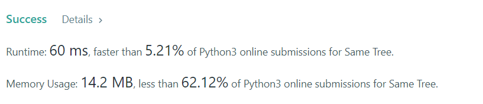

# 100. Same Tree

Given the roots of two binary trees `p` and `q`, write a function to check if they are the same or not.

Two binary trees are considered the same if they are structurally identical, and the nodes have the same value.

**Example 1:**


```
Input: p = [1,2,3], q = [1,2,3]
Output: true
```

**Example 2:**


```
Input: p = [1,2], q = [1,null,2]
Output: false
```

**Example 3:**


```
Input: p = [1,2,1], q = [1,1,2]
Output: false
```

**Constraints:**

* The number of nodes in both trees is in the range `[0, 100]`.
* -10<sup>4</sup> <= Node.val <= 10<sup>4</sup>

## My solution 
```python
# Definition for a binary tree node.
# class TreeNode:
#     def __init__(self, val=0, left=None, right=None):
#         self.val = val
#         self.left = left
#         self.right = right
class Solution:
    def isSameTree(self, p: Optional[TreeNode], q: Optional[TreeNode]) -> bool:
        if p == None and q == None:
            return True
        
        if p == None and q != None:
            return False
        
        if p != None and q == None:
            return False
        
        if p.val != q.val:
            return False
        
        return self.isSameTree(p.left,q.left) and self.isSameTree(p.right,q.right)
```

## My submission


