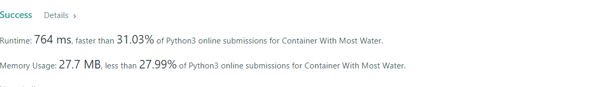
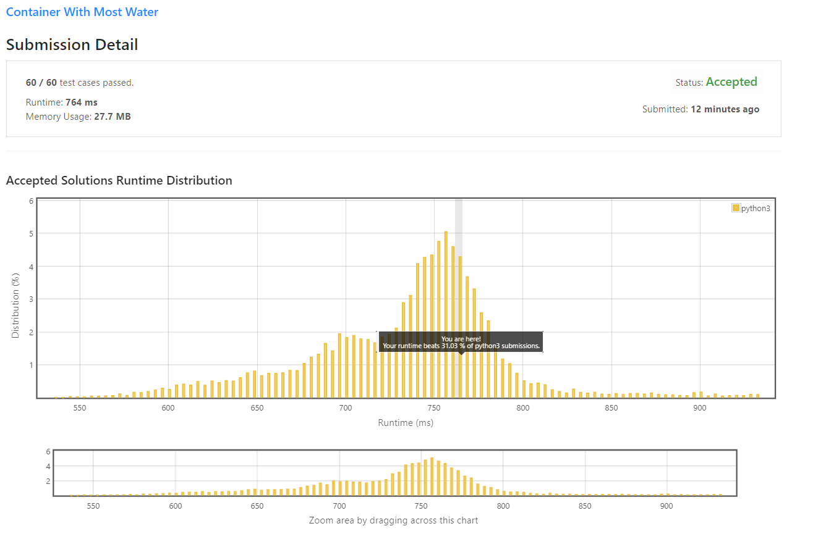

# Container With Most Water

Given `n` non-negative integers `a1, a2, ..., an` , where each represents a point at coordinate `(i, ai)`. `n` vertical lines are drawn such that the two endpoints of the line `i` is at `(i, ai)` and `(i, 0)`. Find two lines, which, together with the `x-axis` forms a container, such that the container contains the most water.

Notice that you may not slant the container.

 

**Example 1:**


```
Input: height = [1,8,6,2,5,4,8,3,7]
Output: 49
Explanation: The above vertical lines are represented by array [1,8,6,2,5,4,8,3,7]. In this case, the max area of water (blue section) the container can contain is 49.
```

**Example 2:**
```
Input: height = [1,1]
Output: 1
```

**Example 3:**
```
Input: height = [4,3,2,1,4]
Output: 16
```

**Example 4:**
```
Input: height = [1,2,1]
Output: 2
``` 

**Constraints:**

* `n == height.length`
* 2 <= `n` <= 10<sup>5</sup>
* 0 <= `height[i]` <= 10<sup>4</sup>

## My Solution 
**Brute Force**
```python
class Solution:
    def maxArea(self, height: List[int]) -> int:
        max_water = 0 
        for i in range(len(height)-1):
            for j in range(i+1,len(height)):
                w = j-i
                h = min(height[i],height[j])
                max_water = max(max_water,w*h)
        return max_water
```

* Time complexity : 

* Space complexity : 

**Two Pointer**

Pointer moves looking for higher `height`. (retain higher `height`)

```python
class Solution:
    def maxArea(self, height: List[int]) -> int:
        l = 0
        r = len(height)-1 
        max_water = 0 
        
        while l<r: 
            max_water = max((r-l)*min(height[l],height[r]),max_water)
            if height[l] < height[r]:
                l +=1
            else:
                r -=1 
        return max_water
```

* Time complexity : 

* Space complexity : 

## My Submission 


