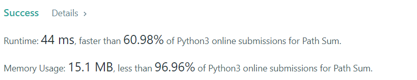

# 112. Path Sum

Given the `root` of a binary tree and an integer `targetSum`, return `true` if the tree has a **root-to-leaf** path such that adding up all the values along the path equals `targetSum`.

A **leaf** is a node with no children.

**Example 1:**


```
Input: root = [5,4,8,11,null,13,4,7,2,null,null,null,1], targetSum = 22
Output: true
```

**Example 2:**


```
Input: root = [1,2,3], targetSum = 5
Output: false
```

**Example 3:**
```
Input: root = [1,2], targetSum = 0
Output: false
```


**Constraints:**

* The number of nodes in the tree is in the range `[0, 5000]`.
* `-1000 <= Node.val <= 1000`
* `-1000 <= targetSum <= 1000`

## My Solution

Just use recursive
```python
# Definition for a binary tree node.
class TreeNode:
    def __init__(self, val=0, left=None, right=None):
        self.val = val
        self.left = left
        self.right = right
        
class Solution:
    def hasPathSum(self, root: Optional[TreeNode], targetSum: int) -> bool:
        if not root:
            return False
        
        new_target = targetSum - root.val
        
        if not root.left and not root.right: 
            return new_target == 0 
        
        return self.hasPathSum(root.left,new_target) or self.hasPathSum(root.right,new_target)
        
```

## My submission




