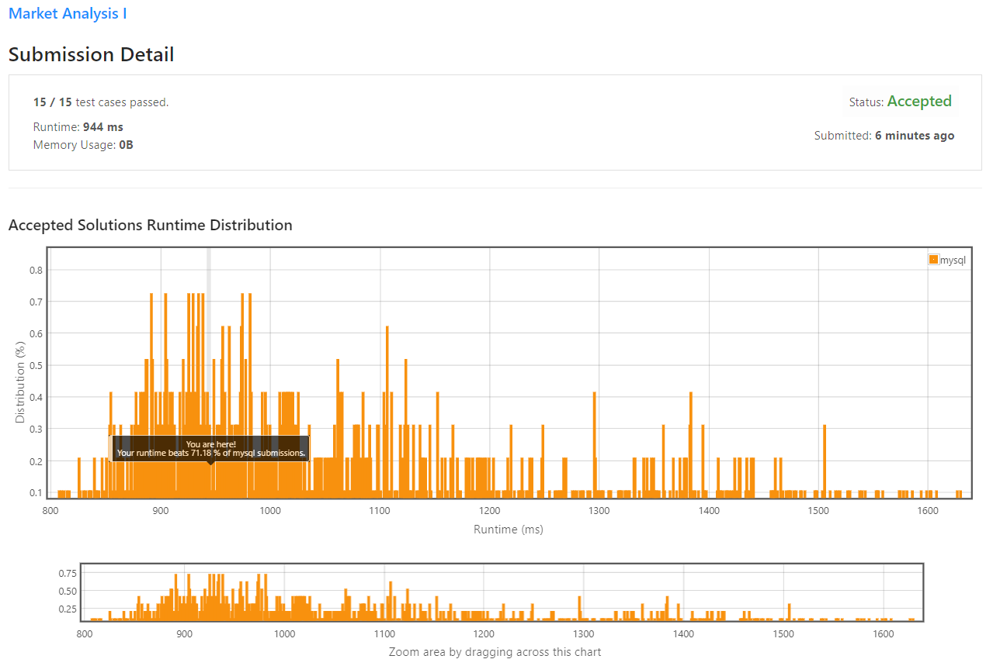

# Market Analysis I

Table: `Users`
```
+----------------+---------+
| Column Name    | Type    |
+----------------+---------+
| user_id        | int     |
| join_date      | date    |
| favorite_brand | varchar |
+----------------+---------+
user_id is the primary key of this table.
This table has the info of the users of an online shopping website where users can sell and buy items.
```

Table: `Orders`
```
+---------------+---------+
| Column Name   | Type    |
+---------------+---------+
| order_id      | int     |
| order_date    | date    |
| item_id       | int     |
| buyer_id      | int     |
| seller_id     | int     |
+---------------+---------+
order_id is the primary key of this table.
item_id is a foreign key to the Items table.
buyer_id and seller_id are foreign keys to the Users table.
```

Table: `Items`
```
+---------------+---------+
| Column Name   | Type    |
+---------------+---------+
| item_id       | int     |
| item_brand    | varchar |
+---------------+---------+
item_id is the primary key of this table.
```

Write an SQL query to find for each user, the join date and the number of orders they made as a buyer in **2019**.
```
The query result format is in the following example:

Users table:
+---------+------------+----------------+
| user_id | join_date  | favorite_brand |
+---------+------------+----------------+
| 1       | 2018-01-01 | Lenovo         |
| 2       | 2018-02-09 | Samsung        |
| 3       | 2018-01-19 | LG             |
| 4       | 2018-05-21 | HP             |
+---------+------------+----------------+

Orders table:
+----------+------------+---------+----------+-----------+
| order_id | order_date | item_id | buyer_id | seller_id |
+----------+------------+---------+----------+-----------+
| 1        | 2019-08-01 | 4       | 1        | 2         |
| 2        | 2018-08-02 | 2       | 1        | 3         |
| 3        | 2019-08-03 | 3       | 2        | 3         |
| 4        | 2018-08-04 | 1       | 4        | 2         |
| 5        | 2018-08-04 | 1       | 3        | 4         |
| 6        | 2019-08-05 | 2       | 2        | 4         |
+----------+------------+---------+----------+-----------+

Items table:
+---------+------------+
| item_id | item_brand |
+---------+------------+
| 1       | Samsung    |
| 2       | Lenovo     |
| 3       | LG         |
| 4       | HP         |
+---------+------------+

Result table:
+-----------+------------+----------------+
| buyer_id  | join_date  | orders_in_2019 |
+-----------+------------+----------------+
| 1         | 2018-01-01 | 1              |
| 2         | 2018-02-09 | 2              |
| 3         | 2018-01-19 | 0              |
| 4         | 2018-05-21 | 0              |
+-----------+------------+----------------+

```

## My Solution 

Simple solution using `LEFT JOIN`, without subquery. 

1. Select all users and join date information. 
2. Join with orders. use `user_id = buyer_id and LEFT order_date = 2019` as filter
3. Apply aggregation `COUNT`

```sql
SELECT U.user_id AS buyer_id, U.join_date, COUNT(O.item_id) as orders_in_2019
FROM Users U 
LEFT JOIN Orders O 
ON U.user_id = O.buyer_id AND LEFT(O.order_date,4) = 2019 
GROUP BY 1
```

## My Submission 



