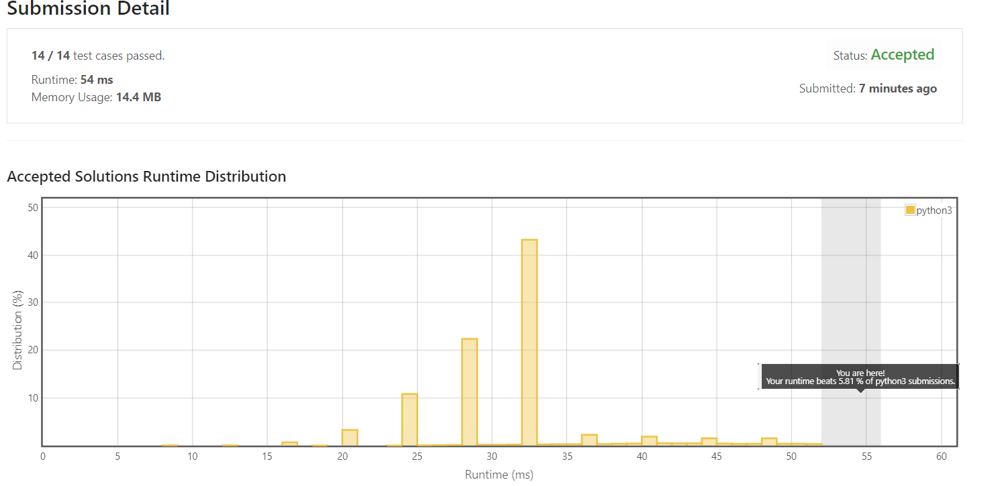

# 118. Pascal's Triangle

Given an integer numRows, return the first numRows of **Pascal's triangle**.

In **Pascal's triangle**, each number is the sum of the two numbers directly above it as shown:


**Example 1:**
```
Input: numRows = 5
Output: [[1],[1,1],[1,2,1],[1,3,3,1],[1,4,6,4,1]]
```
**Example 2:**
```
Input: numRows = 1
Output: [[1]]
```

**Constraints:**

* `1 <= numRows <= 30`


## My Solution 

* just ordinary solution: use addition from previous layer. 

```python
class Solution:
    def generate(self, numRows: int) -> List[List[int]]:
        pas_tri = [] 
        line1 = [1]
        line2 = [1,1]
        pas_tri.append(line1)
        if numRows == 1:
            return pas_tri 
            
        pas_tri.append(line2)
        
        for i in range(2,numRows): 
            last_row = pas_tri[-1]
            line_i = []
            for j in range(i+1): 
                if j == 0 or j ==i:
                    line_i.append(1)
                else: 
                    line_i.append(last_row[j-1]+last_row[j])
            pas_tri.append(line_i)
            
        return pas_tri
```

## My submission 





