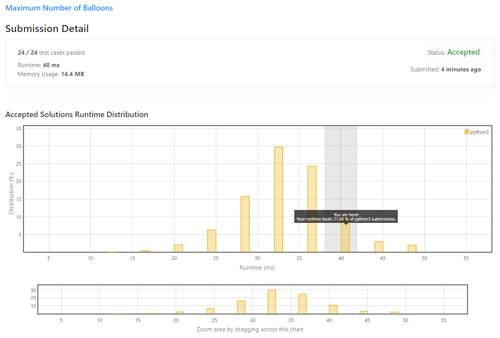

# Maximum Number of Balloons

Given a string `text`, you want to use the characters of `text` to form as many instances of the word **"balloon"** as possible.

You can use each character in `text` **at most once**. Return the maximum number of instances that can be formed.


**Example 1:**
```
Input: text = "nlaebolko"
Output: 1
```

**Example 2:**
```
Input: text = "loonbalxballpoon"
Output: 2
```

**Example 3:**
```
Input: text = "leetcode"
Output: 0
 ```

**Constraints:**

* 1 <= `text.length` <= 10<sup>4</sup>
* text consists of lower case English letters only.

## My Solution 
```python
class Solution:
    def maxNumberOfBalloons(self, text: str) -> int:
        count_t = Counter(text)
        count_ballon = [count_t['a'], count_t['b'], count_t['n'], count_t['l'] / 2, count_t['o'] / 2]
        return int(min(count_ballon))
```
 
## My Submission


