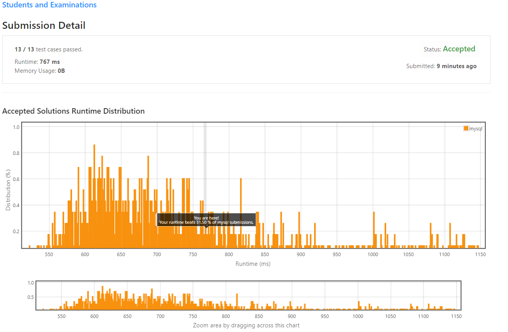

# Students and Examinations

Table `Students`
```
+---------------+---------+
| Column Name   | Type    |
+---------------+---------+
| student_id    | int     |
| student_name  | varchar |
+---------------+---------+
student_id is the primary key for this table.
Each row of this table contains the ID and the name of one student in the school.
```

Table `Subjects`
```
+--------------+---------+
| Column Name  | Type    |
+--------------+---------+
| subject_name | varchar |
+--------------+---------+
subject_name is the primary key for this table.
Each row of this table contains the name of one subject in the school.
```
Table `Examinations`
``` 
+--------------+---------+
| Column Name  | Type    |
+--------------+---------+
| student_id   | int     |
| subject_name | varchar |
+--------------+---------+
There is no primary key for this table. It may contain duplicates.
Each student from the Students table takes every course from Subjects table.
Each row of this table indicates that a student with ID student_id attended the exam of subject_name.
```

Write an SQL query to find the number of times each student attended each exam.

Order the result table by `student_id` and `subject_name`.

The query result format is in the following example:

``` 
Students table:
+------------+--------------+
| student_id | student_name |
+------------+--------------+
| 1          | Alice        |
| 2          | Bob          |
| 13         | John         |
| 6          | Alex         |
+------------+--------------+
Subjects table:
+--------------+
| subject_name |
+--------------+
| Math         |
| Physics      |
| Programming  |
+--------------+
Examinations table:
+------------+--------------+
| student_id | subject_name |
+------------+--------------+
| 1          | Math         |
| 1          | Physics      |
| 1          | Programming  |
| 2          | Programming  |
| 1          | Physics      |
| 1          | Math         |
| 13         | Math         |
| 13         | Programming  |
| 13         | Physics      |
| 2          | Math         |
| 1          | Math         |
+------------+--------------+
Result table:
+------------+--------------+--------------+----------------+
| student_id | student_name | subject_name | attended_exams |
+------------+--------------+--------------+----------------+
| 1          | Alice        | Math         | 3              |
| 1          | Alice        | Physics      | 2              |
| 1          | Alice        | Programming  | 1              |
| 2          | Bob          | Math         | 1              |
| 2          | Bob          | Physics      | 0              |
| 2          | Bob          | Programming  | 1              |
| 6          | Alex         | Math         | 0              |
| 6          | Alex         | Physics      | 0              |
| 6          | Alex         | Programming  | 0              |
| 13         | John         | Math         | 1              |
| 13         | John         | Physics      | 1              |
| 13         | John         | Programming  | 1              |
+------------+--------------+--------------+----------------+
The result table should contain all students and all subjects.
Alice attended Math exam 3 times, Physics exam 2 times and Programming exam 1 time.
Bob attended Math exam 1 time, Programming exam 1 time and didn't attend the Physics exam.
Alex didn't attend any exam.
John attended Math exam 1 time, Physics exam 1 time and Programming exam 1 time.
```

## My Solution 
I create 2 `table` 

* Table A: Counter the student attendend `group by` `student_id` and `subject_name` 
```sql
SELECT student_id, subject_name, count(*) counter
	FROM examinations EX 
	GROUP BY student_id,subject_name
```

```
+------------+--------------+---------+
| student_id | subject_name | counter |
+------------+--------------+---------+
|          1 | Math         |       3 |
|          1 | Physics      |       2 |
|          1 | Programming  |       1 |
|          2 | Math         |       1 |
|          2 | Programming  |       1 |
|         13 | Math         |       1 |
|         13 | Physics      |       1 |
|         13 | Programming  |       1 |
+------------+--------------+---------+
```

* Table B: `CROSS` On `Subjects` and `Students`
```sql
SELECT student_id, student_name, subject_name 
	FROM students ST, subjects SJ
```

```
+------------+--------------+--------------+
| student_id | student_name | subject_name |
+------------+--------------+--------------+
|          1 | Alice        | Math         |
|          1 | Alice        | Physics      |
|          1 | Alice        | Programming  |
|          2 | Bob          | Math         |
|          2 | Bob          | Physics      |
|          2 | Bob          | Programming  |
|         13 | John         | Math         |
|         13 | John         | Physics      |
|         13 | John         | Programming  |
|          6 | Alex         | Math         |
|          6 | Alex         | Physics      |
|          6 | Alex         | Programming  |
+------------+--------------+--------------+
```

**Solution**

Combine information from `Table A` and `Table B`. 

```sql
WITH TA AS (
	SELECT student_id, subject_name, count(*) counter
	FROM examinations EX 
	GROUP BY student_id,subject_name
),
TB AS (
	SELECT student_id, student_name, subject_name 
	FROM students ST, subjects SJ
)

SELECT TB.student_id, TB.student_name, TB.subject_name,COALESCE(TA.counter,0) AS attended_exams
FROM TB 
LEFT JOIN TA 
ON (TB.student_id = TA.student_id AND TB.subject_name = TA.subject_name)
order by TB.student_id,TB.subject_name
```

## My Submission


