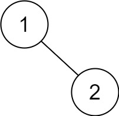
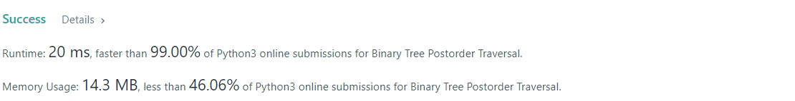

# Binary Tree Postorder Traversal

Given the `root` of a binary tree, return *the postorder traversal of its nodes'* values.

**Example 1:**


```
Input: root = [1,null,2,3]
Output: [3,2,1]
```

**Example 2:**
```
Input: root = []
Output: []
```

**Example 3:**
```
Input: root = [1]
Output: [1]
```

**Example 4:**


```
Input: root = [1,2]
Output: [2,1]
```

**Example 5:**


```
Input: root = [1,null,2]
Output: [2,1]
```
 

**Constraints:**

* `The number of the nodes in the tree is in the range [0, 100]`.
* `-100 <= Node.val <= 100`

## My Solution 
barely still remember from my Data Structure Class 15 years ago. 😁 

```python
# Definition for a binary tree node.
# class TreeNode:
#     def __init__(self, val=0, left=None, right=None):
#         self.val = val
#         self.left = left
#         self.right = right
class Solution:
    def __init__(self):
        self.out = []
        
    def postorderTraversal(self, root: TreeNode) -> List[int]:
        
        if(root is None):
            return self.out
        
        self.postorderTraversal(root.left)
        self.postorderTraversal(root.right)
        self.out.append(root.val)
        
        return self.out
```

## My Submission 


