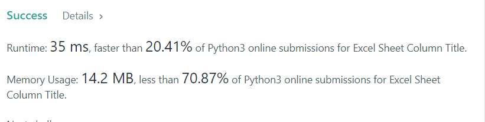

# 168. Excel Sheet Column Title

Given an integer `columnNumber`, return its corresponding column title as it appears in an Excel sheet.

For example:
```
A -> 1
B -> 2
C -> 3
...
Z -> 26
AA -> 27
AB -> 28 
...
```

**Example 1:**
```
Input: columnNumber = 1
Output: "A"
```

**Example 2:**
```
Input: columnNumber = 28
Output: "AB"
```

**Example 3:**
```
Input: columnNumber = 701
Output: "ZY"
```

**Example 4:**
```
Input: columnNumber = 2147483647
Output: "FXSHRXW"
```
 

**Constraints:**

* 1 <= columnNumber <= 2<sup>31</sup> - 1


## My solution 
```python 
class Solution:
    def convertToTitle(self, columnNumber: int) -> str:
        # A = 65 ord('A') chr('65')
        ans = ""
        while columnNumber > 26: 
            end = columnNumber % 26
            if end == 0:
                end = 26 
                columnNumber = columnNumber // 26 -1 
            else:
                columnNumber = columnNumber // 26
                
            ans += chr(64+end)

        ans += (chr(64 + columnNumber))
        return ans[::-1]
        
```

## My submission 


