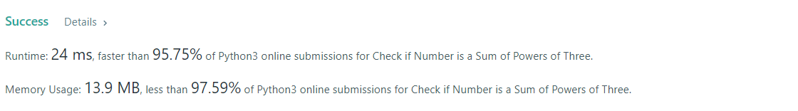
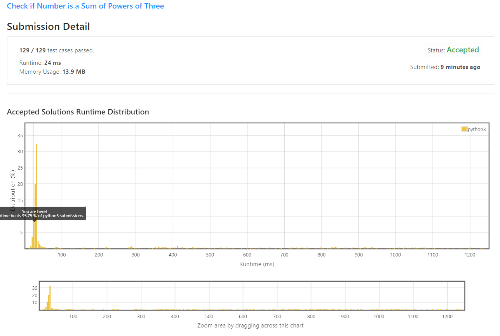

# Check if Number is a Sum of Powers of Three

Given an integer `n`, return `true` if it is possible to represent n as the sum of distinct `powers of three`. Otherwise, return `false`.

An integer `y` is `a power of three` if there exists an integer `x` such that y == 3<sup>x</sup>.

**Example 1:**
```
Input: n = 12
Output: true
Explanation: 12 = 31 + 32
```

**Example 2:**
```
Input: n = 91
Output: true
Explanation: 91 = 30 + 32 + 34
```

**Example 3:**
```
Input: n = 21
Output: false
``` 

**Constraints:**

* 1 <= n <= 10<sup>7</sup>

## My Solution
1. if  `n = 1` => `True`
2. if `n % 3 == 0` => repeat `(div by 3)` 
3. if `n % 3 == 1` => still possible (add by 3<sup>0</sup>). That's why, we need to substract (-1) and continue division. 
4. otherwise return `False`

```python
class Solution:
    def checkPowersOfThree(self, n: int) -> bool:
        if n ==1: 
            return True
        elif (n % 3 == 0):
            return self.checkPowersOfThree(n//3)
        elif (n%3 == 1) : 
            return self.checkPowersOfThree((n-1)//3)
        else: 
            return False    

```

## My Submission



