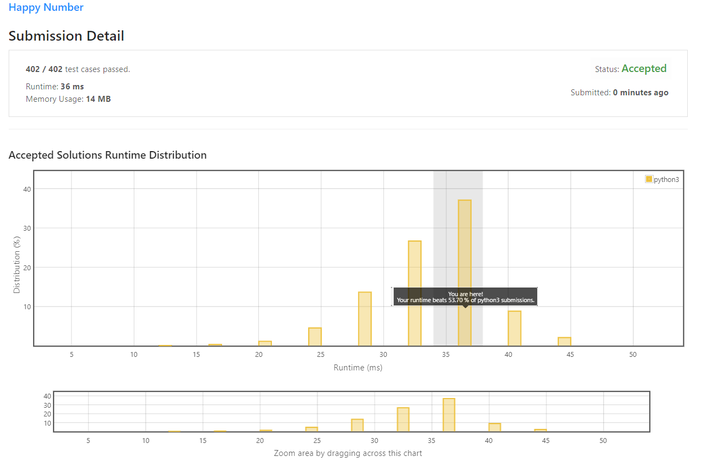

# Happy Number 

Write an algorithm to determine if a number `n` is happy.

A **happy number** is a number defined by the following process:

* Starting with any positive integer, replace the number by the sum of the squares of its digits.
* Repeat the process until the number equals 1 (where it will stay), or it **loops endlessly in a cycle** which does not include 1.
* Those numbers for which this process **ends in 1** are happy.

Return `true` if `n` is a happy number, and `false` if not.

**Example 1:**
```python
Input: n = 19
Output: true
Explanation:
12 + 92 = 82
82 + 22 = 68
62 + 82 = 100
12 + 02 + 02 = 1
```

**Example 2:**
```python
Input: n = 2
Output: false
```

**Constraints:**
* 1 <= n <= 2<sup>31</sup> - 1

## My Solution
I put explanation in <i>comments</i>
```python
def isHappy(n):
    checked = set() # create set to store the number that we have checked
    
    while 1:
        s = str(n) # convert number into string
        
        nn = 0 # temporary variable to store the number sum. 
        for i in range(len(s)): 
            nn += int(s[i]) ** 2 # take square and sum
        
        n = nn 
        if n == 1: # return True if n=1
            return True
        
        if n in checked: # return False if the summation back to number that we have checked. 
            return False
        else:
            checked.add(n) # otherwise put number into Set
```
 
## My Submission 
