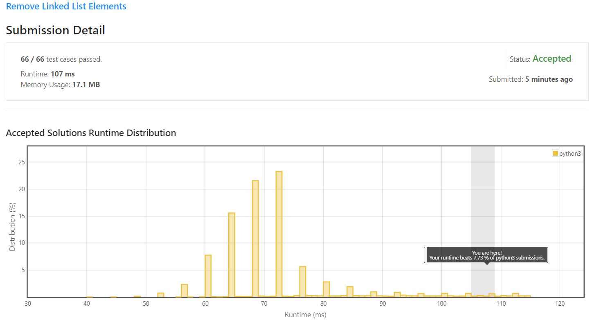

# 203. Remove Linked List Elements

Given the `head` of a linked list and an integer `val`, remove all the nodes of the linked list that has `Node.val == val`, and return *the new head*.

**Example 1:**

```
Input: head = [1,2,6,3,4,5,6], val = 6
Output: [1,2,3,4,5]
```

**Example 2:**
```
Input: head = [], val = 1
Output: []
```

**Example 3:**
```
Input: head = [7,7,7,7], val = 7
Output: []
```
 

**Constraints:**

* The number of nodes in the list is in the range [0, 10<sup>4</sup>].
* `1 <= Node.val <= 50`
* `0 <= val <= 50`

## My solution 

1. Create dummy node before head. 
2. iterate and remove node if node.val == val


```python
# Definition for singly-linked list.
# class ListNode:
#     def __init__(self, val=0, next=None):
#         self.val = val
#         self.next = next
class Solution:
    def removeElements(self, head: Optional[ListNode], val: int) -> Optional[ListNode]:
        prev = ListNode(0,head)
        curr = prev  
        while curr.next:
            if curr.next.val == val:
                curr.next = curr.next.next
            else:
                curr = curr.next
        return prev.next     
```

## My Submission 

