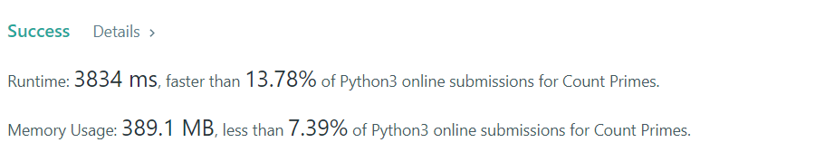
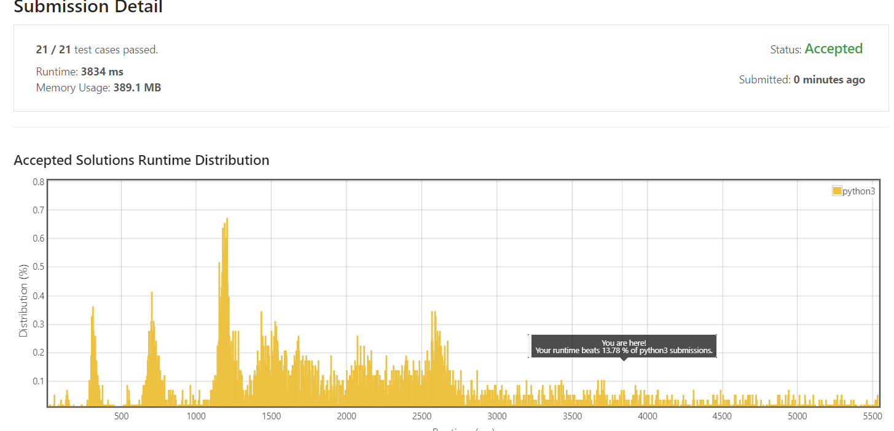

# 204. Count Primes

Count the number of prime numbers less than a non-negative number, `n`.

**Example 1:**
```
Input: n = 10
Output: 4
Explanation: There are 4 prime numbers less than 10, they are 2, 3, 5, 7.
```

**Example 2:**
```
Input: n = 0
Output: 0
```

**Example 3:**
```
Input: n = 1
Output: 0
```

Constraints:

* `0 <= n <= 5 * 106`


## My solution 

1. Brute force 
* Check all numbers division. 

```python
def is_prime(n):
    if n <= 1:
        return False
    for i in range(2,n):
        if n%i == 0:
            return False
    return True 

def count_prime(n): 
    nn = range(n)
    counter = 0 
    for i in range(n): 
        if is_prime(i):
            counter +=1 
    return counter

n=10
print(is_prime(n))
print(count_prime(n))
```

But, this solution is not accepted by Leedcode, because of memory & time constraints. 

2. I used **Sieve of Eratosthenes**, please the following [link](https://en.wikipedia.org/wiki/Sieve_of_Eratosthenes) for further details.
It's basically, flag all the non-prime number and its multiples. Take the remaining unflag as the number of prime. 

```python
class Solution:
    def countPrimes(self, n: int) -> int:
        if n <=2: 
            return 0 
        
        non_prime = {}
        for i in range(2,int(sqrt(n))+1): 
            if i not in non_prime: 
                for j in range(i*i,n,i):
                    non_prime[j] = 1
                
        return n - len(non_prime) - 2 
```

## My submission 


