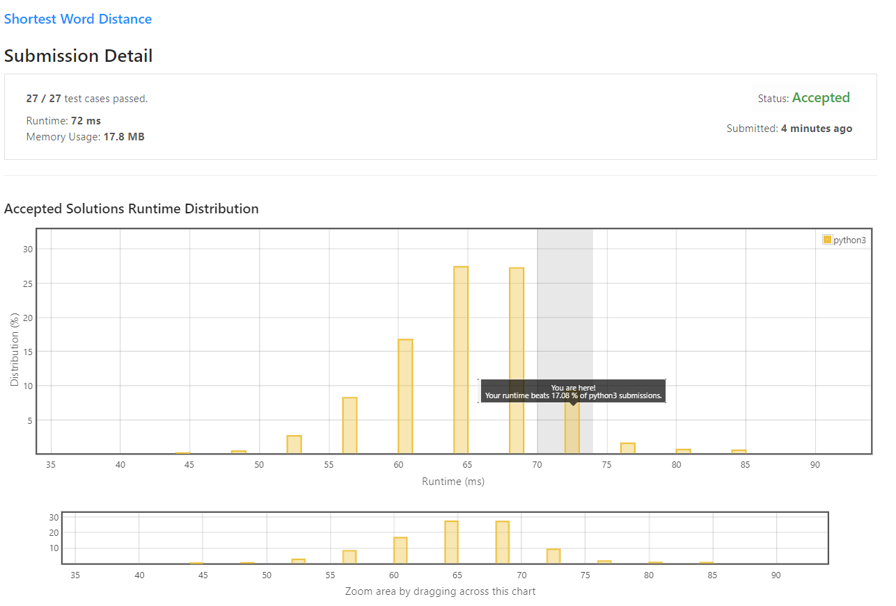

# Shortest Word Distance

Given an array of strings `wordsDict` and two different strings that **already exist** in the array `word1` and `word2`, return **the shortest distance between these two words in the list**.

 

**Example 1:**

Input: wordsDict = ["practice", "makes", "perfect", "coding", "makes"], word1 = "coding", word2 = "practice"
Output: 3
**Example 2:**

Input: wordsDict = ["practice", "makes", "perfect", "coding", "makes"], word1 = "makes", word2 = "coding"
Output: 1
 

**Constraints:**

* 1 <= `wordsDict.length` <= 3 * 10<sup>4</sup>
* 1 <= `wordsDict[i].length` <= 10
* `wordsDict[i]` consists of lowercase English letters.
* `word1` and `word2` are in `wordsDict`.
* `word1 != word2`

## My Solution 

Just iterate and find the minimum distance. 

```python
class Solution:
    def shortestDistance(self, wordsDict: List[str], word1: str, word2: str) -> int:
        idx1 = -1 
        idx2 = -1
        min_d = 3 * 10**4
        for i in range(len(wordsDict)):
            if wordsDict[i] == word1:
                idx1 = i
            if wordsDict[i] == word2:
                idx2 = i
            
            if idx1 > -1 and idx2 > -1: 
                ds = abs(idx1 - idx2)
                if ds < min_d:
                    min_d = ds
            
        return min_d
```

## My Submission 



