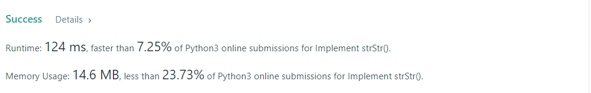

# Implement strStr()

Implement `strStr()`.

Return the index of the first occurrence of `needle` in `haystack`, or `-1` if needle is not part of haystack.

**Clarification:**

What should we return when `needle` is an empty string? This is a great question to ask during an interview.

For the purpose of this problem, we will return `0` when `needle` is an empty string. This is consistent to C's `strstr()` and Java's `indexOf()`.


**Example 1:**
```
Input: haystack = "hello", needle = "ll"
Output: 2
```

**Example 2:**
```
Input: haystack = "aaaaa", needle = "bba"
Output: -1
```

**Example 3:**
```
Input: haystack = "", needle = ""
Output: 0
``` 

**Constraints:**

* `0` <= `haystack.length`, `needle.length` <= 5 * 10<sup>4</sup>
* `haystack` and `needle` consist of only lower-case English characters.

## My Solution 
```python
class Solution:
    def strStr(self, haystack: str, needle: str) -> int:
        if haystack =="" and needle=="":
            return 0
        
        for i in range(len(haystack)):
            subst = haystack[i:i+len(needle)]
            if needle in subst:
                return i
        return -1
```

## My Submission 


