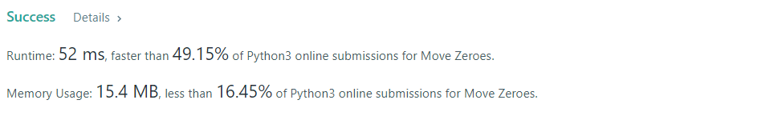
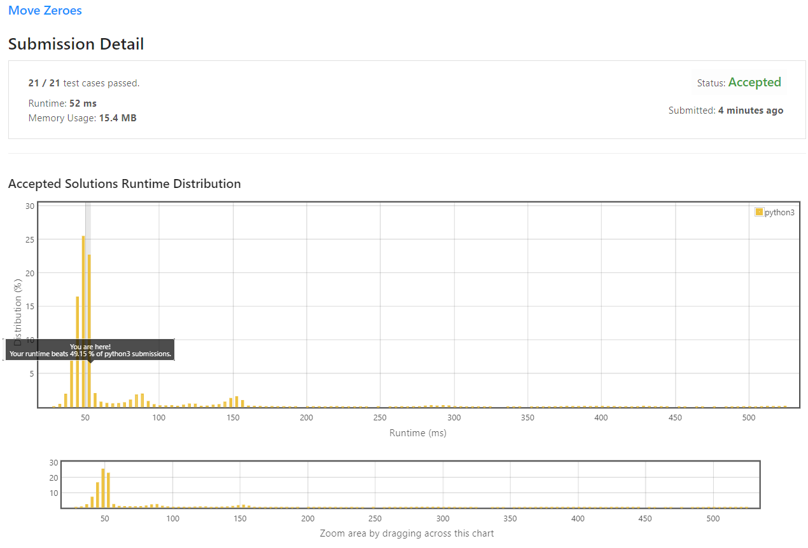

# Move Zeroes

Given an integer array `nums`, move all `0`'s to the end of it while maintaining the relative order of the non-zero elements.

**Note** that you must do this in-place without making a copy of the array.

**Example 1:**
```
Input: nums = [0,1,0,3,12]
Output: [1,3,12,0,0]
```

**Example 2:**
```
Input: nums = [0]
Output: [0]
``` 

**Constraints:**

* 1 <= `nums.length` <= 10<sup>4</sup>
* -2<sup>31</sup> <= `nums[i]` <= 2<sup>31</sup> - 1
 

**Follow up:** Could you minimize the total number of operations done?

## My Solution 

Just shift the non-zero number into early index. 

```python
class Solution:
    def moveZeroes(self, nums: List[int]) -> None:
        """
        Do not return anything, modify nums in-place instead.
        """
        nonzeroid = -1 
        for i in range(len(nums)): 
            if nums[i] != 0: 
                nonzeroid +=1
                nums[nonzeroid] = nums[i]
        
        for i in range(nonzeroid+1,len(nums)):
            nums[i] = 0
```

## My Submission


