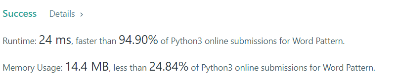

# 290. Word Pattern

Given a `patter`n and a string `s`, find if `s` follows the same pattern.

Here **follow** means a full match, such that there is a bijection between a letter in `pattern` and a **non-empty** word in `s`.


**Example 1:**
```
Input: pattern = "abba", s = "dog cat cat dog"
Output: true
```

**Example 2:**
```
Input: pattern = "abba", s = "dog cat cat fish"
Output: false
```

**Example 3:**
```
Input: pattern = "aaaa", s = "dog cat cat dog"
Output: false
```

**Example 4:**
```
Input: pattern = "abba", s = "dog dog dog dog"
Output: false
```
 
**Constraints:**

* `1 <= pattern.length <= 300`
* pattern contains only **lower-case** English letters.
* `1 <= s.length <= 3000`
* `s` contains only lower-case English letters and spaces `' '`.
* `s` does not contain any leading or trailing spaces.
* All the words in `s` are separated by a single space.


## My solution 
1. create dictionary for words and pattern. 
2. iterate the pattern and words.
3. if the pattern and words is not exist in the dictionary, then insert it. 
4. if the pattern and words is exist then check if the pattern correct or not. 

```python
class Solution:
    def wordPattern(self, pattern: str, s: str) -> bool:
        dic_s = {}
        words = s.split(" ")      
        
        if len(words) != len(pattern):
            return False
        
        for i in range(len(words)):
            
            if pattern[i] not in dic_s.keys():
                # masukan ke dictionary, jika benar
                if words[i] not in dic_s.values():
                    dic_s[pattern[i]] = words[i]
                else:
                    return False
            else:
                # check pattern nya sama tidak
                if dic_s[pattern[i]] != words[i]:
                    return False
            #print(dic_s)    
        return True
```

## My Submission 

