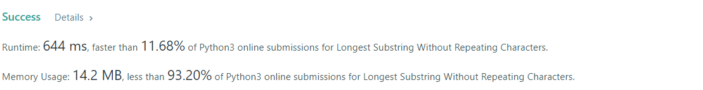
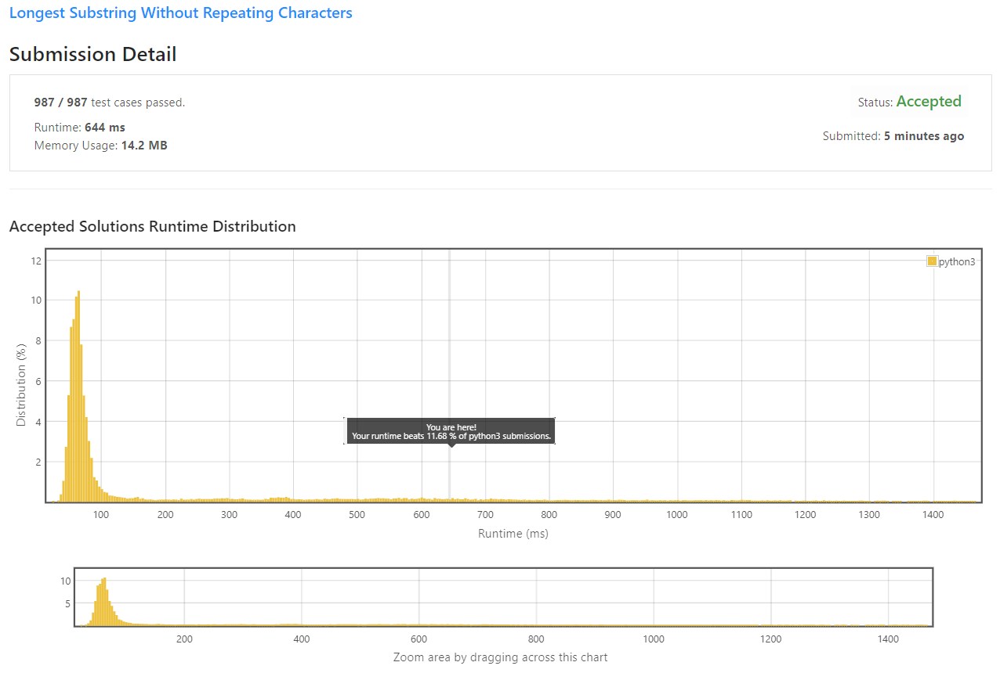

# Longest Substring Without Repeating Characters

Given a string `s`, find the length of **the longest substring without repeating characters**.

 

**Example 1:**
```
Input: s = "abcabcbb"
Output: 3
Explanation: The answer is "abc", with the length of 3.
```

**Example 2:**
```
Input: s = "bbbbb"
Output: 1
Explanation: The answer is "b", with the length of 1.
```

**Example 3:**
```
Input: s = "pwwkew"
Output: 3
Explanation: The answer is "wke", with the length of 3.
Notice that the answer must be a substring, "pwke" is a subsequence and not a substring.
```

**Example 4:**
```
Input: s = ""
Output: 0
```

**Constraints:**

* 0 <= `s.length` <= 5 * 10<sup>4</sup>
* `s` consists of English letters, digits, symbols and spaces.


## My Solution 
I just used simplest solution I could think of, which is `Two Pointers`

```python
class Solution:
    def lengthOfLongestSubstring(self, s: str) -> int:
        subs = set()
        out = 0 

        for i in range(len(s)):
            for j in range(i,len(s)): 
                if s[j] not in subs:
                    subs.add(s[j])
                    if len(subs) > out:
                        out = len(subs)
                        #print(subs)
                else:            
                    subs = set()
                    break
            subs = set()
        return out
```

## My Submission

