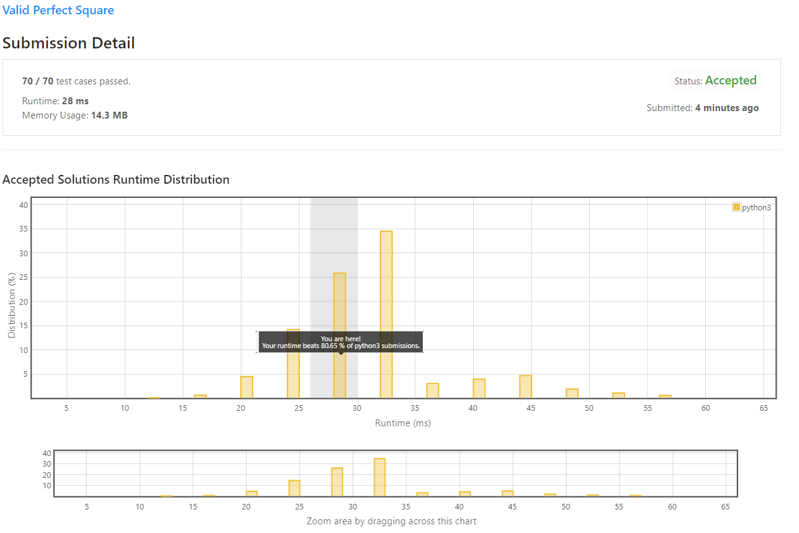
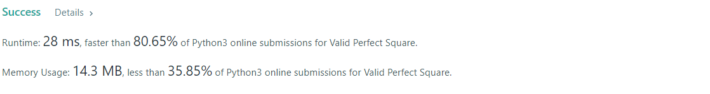

# Valid Perfect Square

Given a **positive** integer `num`, write a function which returns True if `num` is a perfect square else False.

**Follow up: Do not** use any built-in library function such as sqrt.

**Example 1:** 
```
Input: num = 16
Output: true
```

**Example 2:**
```
Input: num = 14
Output: false
```

**Constraints:**

* 1 <= num <= 2<sup>31</sup> - 1

## My Solution 
I used Binary Search to check all the number from 1 from `num // 2`
```python
class Solution:
    def isPerfectSquare(self, num: int) -> bool:
        if num == 1:
            return True
    
        #st = int(sqrt(num))-1
        st = 1
        en =  int(num//2)+1
        
        while st < en: 
            avg = (st+en)//2
            sq = avg**2 
            if sq == num: 
                return True
            if sq > num: 
                en = avg
            else:
                st = (avg + 1)
            
        return False
```

## My Submission 

