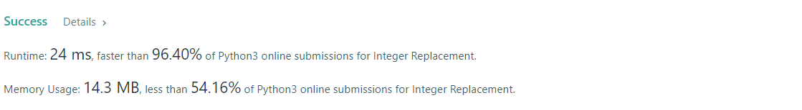
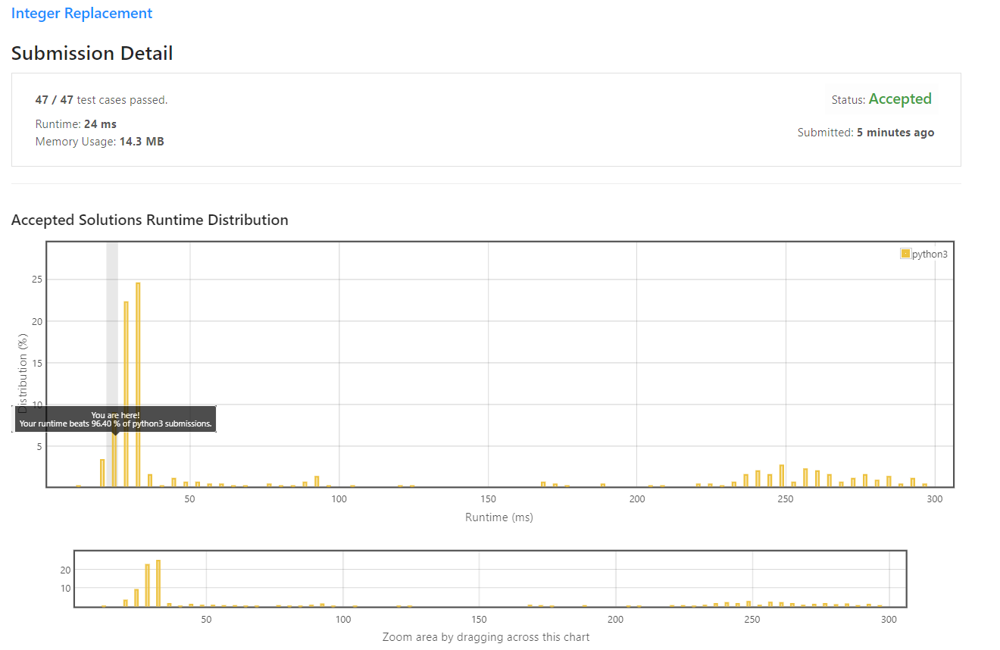

# Integer Replacement

Given a positive integer `n`, you can apply one of the following operations:

* If `n` is `even`, replace `n` with `n / 2`.
* If `n` is `odd`, replace `n` with either `n + 1` or `n - 1`.
Return the minimum number of operations needed for `n` to become `1`.
  
**Example 1:**
```
Input: n = 8
Output: 3
Explanation: 8 -> 4 -> 2 -> 1
```

**Example 2:**
```
Input: n = 7
Output: 4
Explanation: 7 -> 8 -> 4 -> 2 -> 1
or 7 -> 6 -> 3 -> 2 -> 1
```

**Example 3:**
```
Input: n = 4
Output: 2
```

**Constraints:**
* 1 <= n <= 2<sup>31</sup> - 1

## My Solution 
*Some tricks:*

1. `n` is `even`, `n = n/2`
2. `n` = `3`, return `2`
3. `(n+1) mod 4 == 0`, `n = n + 1`
4. *Otherwise* `n = n-1`

```python
class Solution:
    def integerReplacement(self, n: int) -> int:
        counter = 0
        while n != 1: 
            if n % 2 == 0:
                n = n //2
            elif n == 3:
                return counter+2
            elif (n+1) % 4 == 0:
                n += 1
            else:
                n -= 1
            counter += 1
            
        return counter
```

## My Submission 




