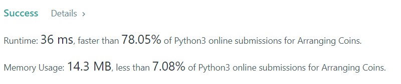
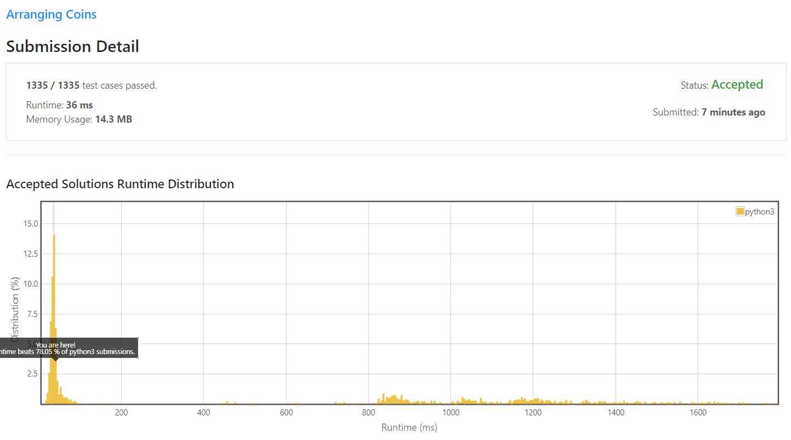

You have `n` coins and you want to build a staircase with these coins. The staircase consists of `k` rows where the i<sup>th</sup> row has exactly `i` coins. The last row of the staircase may be incomplete.

Given the integer `n`, return the number of **complete rows** of the staircase you will build.

**Example 1:**

![example1][arrangecoins1-grid.jpg]
```
Input: n = 5
Output: 2
Explanation: Because the 3rd row is incomplete, we return 2.
```

**Example 2:**
![example2][arrangecoins2-grid.jpg]
```
Input: n = 8
Output: 3
Explanation: Because the 4th row is incomplete, we return 3.
```

**Constraints:**

* 1 <= n <= 2<sup>31</sup> - 1

# My solution 

1. Brute Force

```python
class Solution:
    def arrangeCoins(self, n: int) -> int:
        i = 1
        si = (2 + (i-1)) * (i/2)
        while(si < n):
            i +=1
            si = (2 + (i-1)) * (i/2)
                
        if si == n:
            return i
        return i-1
```

2. Math formula 
```python
class Solution:
    def arrangeCoins(self, n: int) -> int:
        return int((2 * n + (1 / 4)) ** 0.5 - 1 / 2)
```

## My submission 


