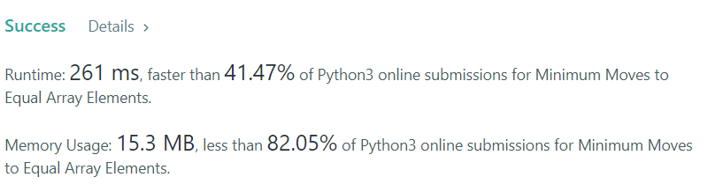
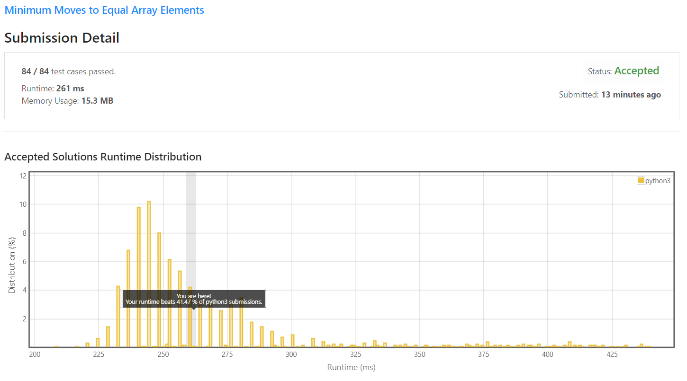

# 453. Minimum Moves to Equal Array Elements

Given an integer array `nums` of size `n`, return the minimum number of moves required to make all array elements equal.

In one move, you can increment `n - 1` elements of the array by `1`.

**Example 1:**
```
Input: nums = [1,2,3]
Output: 3
Explanation: Only three moves are needed (remember each move increments two elements):
[1,2,3]  =>  [2,3,3]  =>  [3,4,3]  =>  [4,4,4]
```

**Example 2:**
```
Input: nums = [1,1,1]
Output: 0
``` 

**Constraints:**

* `n == nums.length`
* 1 <= nums.length <= 10<sup>5</sup>
* -10<sup>9</sup> <= nums[i] <= 10<sup>9</sup>
* The answer is guaranteed to fit in a 32-bit integer.


## My solution 

```python
class Solution:
    def minMoves(self, nums: List[int]) -> int:
        m = min(nums) ## minimal
        ans = 0 ## result 
        for num in nums:
            ans += (num - m) ## result 
        return ans
```

## My submission 


