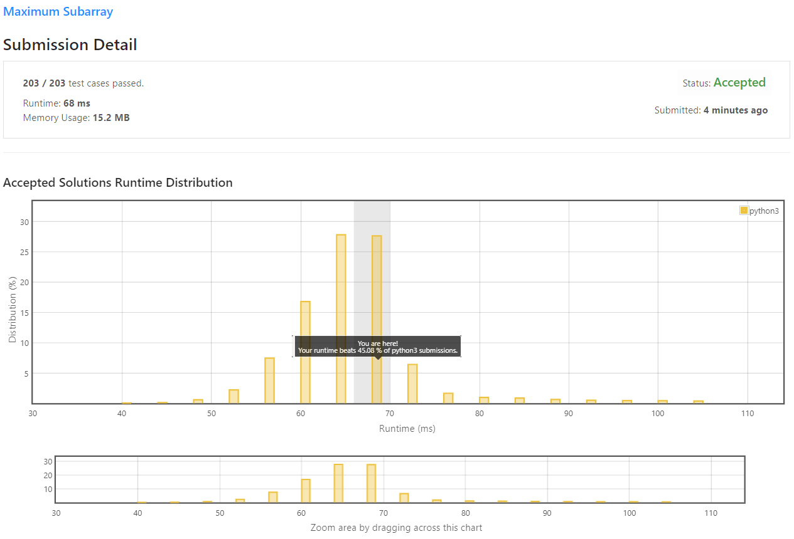

# Maximum Subarray

Given an integer array `nums`, find the contiguous subarray (containing at least one number) which has **the largest sum** and return **its sum**.

**Example 1:**
```
Input: nums = [-2,1,-3,4,-1,2,1,-5,4]
Output: 6
Explanation: [4,-1,2,1] has the largest sum = 6.
```

**Example 2:**
```
Input: nums = [1]
Output: 1
```

**Example 3:**
```
Input: nums = [5,4,-1,7,8]
Output: 23
 ```

**Constraints:**

* 1 <= `nums.length` <= 3 * 10<sup>4</sup>
* -10<sup>5</sup> <= `nums[i]` <= 10<sup>5</sup>

## My Solution

```python
class Solution:
    def maxSubArray(self, nums: List[int]) -> int:
        if len(nums) == 1:
            return nums[0]
        
        currSum = nums[0]
        out = nums[0]
        
        for i in range(1,len(nums)):
            if (currSum + nums[i]) >= nums[i]:
                currSum += nums[i]
            else:
                currSum = nums[i]
            out =  max(out,currSum)
                
        return out
```

## My Submission


