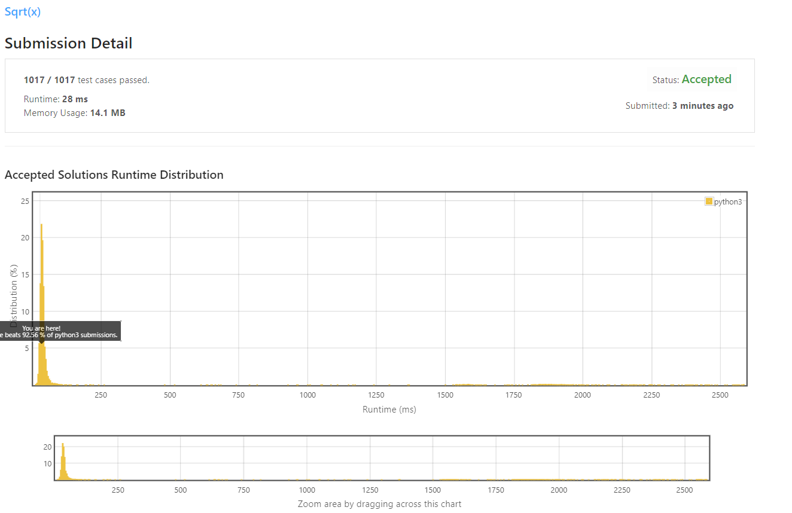
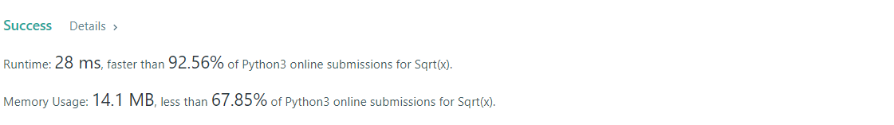

# Sqrt(x)

Given a non-negative integer `x`, compute and return the square root of `x`.

Since the return type is an integer, the decimal digits are **truncated**, and only **the integer part** of the result is returned.

**Note:** You are not allowed to use any built-in exponent function or operator, such as `pow(x, 0.5)` or `x ** 0.5`.

**Example 1:**
```
Input: x = 4
Output: 2
```
**Example 2:**
```
Input: x = 8
Output: 2
Explanation: The square root of 8 is 2.82842..., and since the decimal part is truncated, 2 is returned.
 ```

**Constraints:**

* 0 <= x <= 2<sup>31</sup> - 1

## My Solution 
```python
class Solution:
    def mySqrt(self, x: int) -> int:
        return int(sqrt(x))
```

## My Submission 


