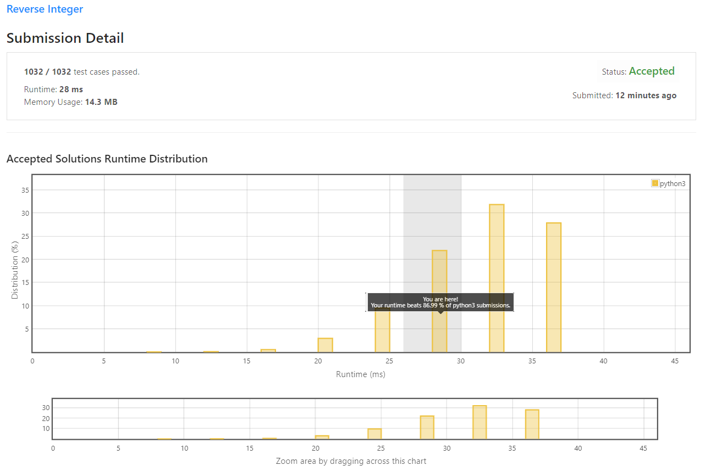

# Reverse Integer

Given a signed 32-bit integer `x`, return `x` with its digits reversed. If reversing x causes the value to go outside the signed 32-bit integer range `[-231, 231 - 1]`, then return `0`.

<b>Assume the environment does not allow you to store 64-bit integers (signed or unsigned).</b>

<b>Example 1:</b>
```python
    Input: x = 123
    Output: 321
```

<b>Example 2:</b>
```python
    Input: x = -123
    Output: -321
```

<b>Example 3:</b>
```python
    Input: x = 120
    Output: 21
```

<b>Example 4:</b>
```python
    Input: x = 0
    Output: 0
```

## My Solution 
After seeing this problem, I am immediately thinking to convert the int into a string. Because it is a common coding interview problem (reverse python using string). 

```python
your_string = 'this is string'
your_reverse_string = your_string[::-1]  
```

But, there are a few things we need to handle here. The first is regarding the negative number. Second, regarding the "Big" number.

So here is my solution.

```python
def reverse(x):
    neg = False
    if x < 0: # check negative
        neg = True
        x = abs(x) #convert into positive 
        
    str_x=str(x) # convert int to string
    r_str_x=str_x[::-1] # reverse the string
    int_x = int(r_str_x) # convert back to int
    
    if int_x > (2**31) or int_x < (-2**31): # handle big number
        return 0

    if neg: # if it is negative number
        int_x = int_x * -1
    
    return int_x
```

**Another alternative solution is using Div and Mod! (So scientist though 😆 )**

## My Submission 

