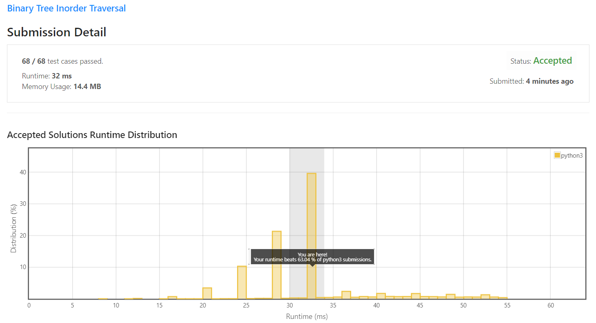

# 94. Binary Tree Inorder Traversal
Given the `root` of a binary tree, return *the inorder traversal of its nodes' values.*

**Example 1:**

```
Input: root = [1,null,2,3]
Output: [1,3,2]
```

**Example 2:**
```
Input: root = []
Output: []
```
**Example 3:**
```
Input: root = [1]
Output: [1]
```
**Example 4:**

```
Input: root = [1,2]
Output: [2,1]
```
**Example 5:**

```
Input: root = [1,null,2]
Output: [1,2]
```
**Constraints:**

* The number of nodes in the tree is in the range [0, 100].
* `-100 <= Node.val <= 100`
 
**Follow up**: Recursive solution is trivial, could you do it iteratively?


## My solution

```python
# Definition for a binary tree node.
# class TreeNode:
#     def __init__(self, val=0, left=None, right=None):
#         self.val = val
#         self.left = left
#         self.right = right
class Solution:
    def inorderTraversal(self, root: Optional[TreeNode]) -> List[int]:
        result = []
        def recursive(curr):
            if curr:
                # First recur on left child
                recursive(curr.left)
                # then print the data of node
                result.append(curr.val),
                # now recur on right child
                recursive(curr.right)
        recursive(root)
        return result
```

## My submission



        